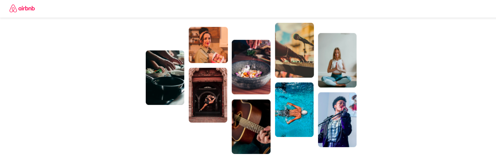
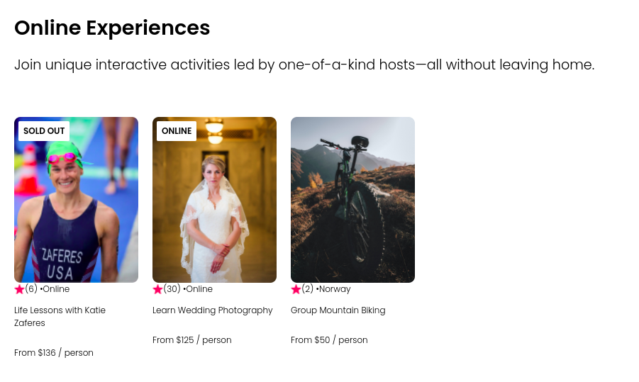

# Airbnb Experiences Website Clone

This is a clone of Airbnb Experiences made using HTML, CSS, and React.

## Features
- Display a list of experiences
- View details of each experience
- Responsive design

## Getting Started

These instructions will get you a copy of the project up and running on your local machine for development and testing purposes.

## Prerequisites

- Node.js
- npm

## Installation

1. Clone the repository

`git clone git@github.com:Nitesh-thapliyal/Airbnb-Experiences-Clone.git`

2. Install dependencies

`npm install`

3. Start the development server

`npm start`

## Built With
- HTML
- CSS
- React

## Acknowledgment

[Scrimba](https://scrimba.com/)